<p align="center">
  
</p>

<h1 align="center">pi-contour</h1>
<p align="center"><strong>See the shape of a change.</strong><br/>Evidence-first structural review for the <a href="https://github.com/earendil-works/pi">pi coding agent</a>.</p>
<p align="center">
  <a href="https://www.npmjs.com/package/pi-contour"></a>
  <a href="https://github.com/monotykamary/pi-contour/actions/workflows/test.yml"></a>
  <a href="LICENSE"></a>
  
</p>
<p align="center"><a href="#install">Install</a> · <a href="#the-loop">The loop</a> · <a href="#what-a-finding-means">Evidence</a> · <a href="docs/physics.md">Physics</a> · <a href="docs/performance.md">Performance</a></p>

> **Fovea brings relevant code into focus. Contour reveals how that structure changes.**
>
> Not an AI detector. Not a quality score. Not a correctness stamp.

A patch can make individual functions shorter while moving decisions into helpers. It can remove a duplicate while creating a heavily coupled abstraction. Contour keeps those tradeoffs visible: **before/after measurements, source witnesses, and a concrete review question**, with heat diffusion showing where a finding's modeled exposure travels.

## Install

For your Pi setup, choose **one** source:

```sh
pi install npm:pi-contour

# Or install directly from GitHub:
pi install git:github.com/monotykamary/pi-contour
```

Restart Pi, or `/reload` in a running session after installation. Requires Pi, Node 20+, and Git. **You do not need to install Fovea separately.** The compiler and versioned `pi-fovea/substrate` are bundled; Pi supplies `typebox`. Git and npm both ship the ready-to-load distribution—no sibling checkout, tsx, compilation, or postinstall script.

Want the standalone `contour` command on your PATH as well?

```sh
bun install -g pi-contour
# npm install -g pi-contour also works
contour review
```

Installing the CLI globally does not register a Pi extension; `pi install` does not promise a global CLI. No hooks, settings, network requests, or repository writes are performed by loading Contour.

## The loop

```text
       while you work                 when you ask / commit
   ┌────────────────────┐            ┌────────────────────────┐
   │ observe → cache    │ ─────────▶ │ pin → compare → reveal │
   │ silent, incremental│            │ witnesses + questions  │
   └────────────────────┘            └────────────────────────┘
```

**Continuous discovery. Checkpoint disclosure.** Successful native/Fabric `pi.*` path access selects a project—even when your Pi cwd is a parent folder or an unrelated launcher. A 32-root recency ring retires the least recently used project on overflow. Root-local Git comparisons never merge unrelated projects merely because they share a parent. Fovea and Contour exchange session-qualified target hints when both are loaded.

A quiet observer debounces successful activity (400ms), alternating recent projects with a round-robin backstop on a 5s scheduling tick. It scans **one root per pass**; 5s is not a per-project guarantee at 32 roots. Once enrolled, editor saves and opaque shell changes are still found by polling. Explicit checkpoints take priority and abort speculative work. Discovery never injects findings, shows notifications, or restarts an agent.

Startup registers the lightweight workspace interface and an unref'ed timer; an empty coordinator never scans cwd. The parser, numerical substrate, and engine load at the first enrolled-project scan or explicit review—not during extension loading or `session_start`. Branch-local root metadata survives compaction/reload/resume; old analysis does not. Reload/shutdown cancels obsolete work. For entirely on-demand analysis:

```sh
CONTOUR_BACKGROUND=0 pi
```

<details>
<summary><strong>Why this stays incremental</strong></summary>

- Git blobs: batched, size-checked, object-ID cached.
- Working-tree reads: device/inode/size/mtime/ctime/mode manifests, not mtime guesses.
- Syntax facts: content + path + parser/semantic versions; bounded persistent reuse across Pi and CLI processes.
- Models: immutable content generations; staging already analyzed bytes reuses the graph.
- Reports: comparison/configuration identity; no-change passes do no parsing, graph assembly, or heat evaluation.
- Numerics: one Chebyshev recurrence per source/operator, reused across timescales.
- Scheduling: serialized, cancellable work; cooperative yields between files and findings.

Defaults: 2,000 source files, 512KiB per source, 32MiB per snapshot; 32 blobs per batch; 24 concurrent file operations. Facts are bounded at 4,000 entries / 48MiB. Graph assembly caps at 20,000 symbols / 80,000 import-and-call sites. Omissions remain visible.

Caches under `$TMPDIR/pi-contour-<uid>/` contain local source-derived metadata, are never uploaded, and can be deleted safely. Polls still run bounded Git/stat discovery. One-file parsing and first-use module loading are synchronous and not free; see the [performance contract](docs/performance.md), not a zero-overhead claim.

</details>

Set `CONTOUR_MAX_ROOTS` to lower the default/cap of 32. Reports label the canonical worktree; `agentOrigin` records the launcher separately. Symlink aliases unify, linked worktrees stay distinct. Native paths remain cwd-relative and no extension changes cwd. Use explicit roots for parallel work.

Enrollment follows successful structured/literal access, never blocked calls or guessed program output. It expands analysis to the containing project, not a per-file sandbox or a trust grant. Automatic discovery excludes broad/private/dependency paths. Analysis Git commands disable fsmonitor and remote/lazy fetching. Non-Git projects report review unavailable instead of silently reviewing the previous repository. Re-entry does not certify an inactive interval.

## Review a patch

In Pi:

```text
/contour review
/contour review working-tree
/contour review staged --root "/projects/service"
```

For the agent:

```ts
contour_review({ target: "staged" }) // most recently selected project
contour_review({ root: "/projects/service", target: "working-tree" })
contour_review({ target: "working-tree", maxTokens: 2500, maxFindings: 8 })
```

From the terminal:

```sh
contour review                      # HEAD → index (default)
contour review --working-tree       # includes nonignored untracked sources
contour review --json               # structured evidence + coverage
contour review --root /path/to/repo --max-tokens 1000
contour --version                   # version of the distribution on PATH
```

**The index is the commit candidate—not the live worktree.** Partially staged files and unchanged dependencies come from pinned Git blobs. Unborn HEAD uses an empty baseline; unmerged indexes are errors. Captures are checked for concurrent drift and reconciled again before returning a fresh report. A moving repository causes a retry error, not approval.

Review never checks out files, stages changes, executes repository code, commits, or runs tests. There is no atomic lock on an external editor or a later commit: every report identifies the snapshot it actually analyzed.

### Reading a checkpoint

The `contour-review` message uses the same compact text renderer as the tool, CLI, and optional hook. It is still an **explicit checkpoint**, not an automatic edit-by-edit sync.

| Mark | Meaning |
|---|---|
| `Δ` | Structural finding, metric delta, or regional change |
| `▪` | Source witness: file, line, and any recorded relationship |
| `↗` | Modeled diffusion exposure—not severity or evidence of a defect |
| `?` | Review question, not a rewrite instruction |
| `⚠` | Incomplete coverage; baseline/target gaps are labeled separately |

An abridged, illustrative report:

```text
Contour · staged · <HEAD> → <snapshot>
Δ SLOC +18; decisions +4; erosion 0.120 → 0.180; verbosity 0.040 → 0.040

Δ [complexity; advisory] parse: decision load increased
  ▪ src/parser.ts:42
  8 → 12 decisions (CC = decisions + 1)
  ↗ Exposure (modeled): t=0.5: 2.0% outside source region; t=2: 8.0% outside source region
  ? Is this additional branching required, or can responsibilities be separated without merely distributing the same decisions?

⚠ Coverage incomplete; absence of findings is not approval.
⚠ Gap (target): worker/job.py — Unsupported language: .py
```

Full reports retain snapshot identities, policy/coverage counts, absolute totals, omitted-finding counts, and the reminder that heat is exposure—not defect probability. Symbols add hierarchy, not new scoring or automatic actions. `--json` remains structured data without presentation glyphs.

## What a finding means

| Signal | Visible evidence | Question, not verdict |
|---|---|---|
| Complexity | Decisions, callable CC, SLOC, erosion, regional totals | Did we simplify the decisions—or redistribute them? |
| Duplication / verbosity | Exact-token clones and explicit syntax-rule witnesses | Is the repetition accidental, or useful independence? |
| Coupling | New direct cross-directory import and its source location | Is this the right boundary to cross? |
| Cycles | New/expanded strongly connected import regions | Does this coordination cost match the design? |
| Exposure | Source mass, conserved mass, neighbors at several scales | Where else should this change receive attention? |

Every finding retains its own category and units. Heat may prioritize review **within a category**; complexity, clone lines, and coupling are not summed into an invented quality number.

<details>
<summary><strong>Exact v0.1 metric scope and limitations</strong></summary>

JS/TS/JSX/TSX, including `.mjs`, `.cjs`, `.mts`, and `.cts`:

- SLOC: lines containing syntax, excluding comments/blank lines.
- Decisions: `if`, loops, conditional expressions, catches, non-default switch cases, `&&`, `||`, `??`.
- Per-callable CC: decisions + 1, excluding nested callable decisions. Callable mass: CC × √SLOC.
- Erosion: callable mass in CC > 10 divided by total callable mass. A diagnostic convention, not a gate.
- Verbosity: union of flagged source lines and clone lines / SLOC, with absolute counts retained.
- Two syntax rules: catch-and-immediate-rethrow; Boolean-literal conditionals.
- Exact-token callable-body clones: at least 30 tokens / 4 source lines. Whitespace/comments ignored, identifiers/literals retained. No near-clone or semantic-equivalence claim.
- Regional function/decision totals expose redistribution that function-level ratios can conceal.

Inspired by [Earendil's article](https://earendil.com/posts/measuring-code-sloppiness/) and [SlopCodeBench](https://arxiv.org/html/2603.24755v1), **not a reproduction of their full ruleset or cross-repository calibration**. Test files are included. Generated/declaration files and unsupported languages are disclosed as omissions. Bare aliases and dynamic/runtime resolution remain limited; unresolved imports may simply be external dependencies.

</details>

## Same heat. Different question.

[Fovea](https://github.com/monotykamary/pi-fovea) owns graph assembly and the numerical solver. Contour feeds the shared **`pi-fovea/substrate` API** immutable syntax facts, not rendered navigation output or mutable session state.

Each selected finding seeds one unit of mass. Contour's conservative undirected conductance projection transports it through the forward, mass-conserving heat field:

$$
p(t)=D^{1/2}e^{-tL_{\mathrm{sym}}}D^{-1/2}q,
\qquad \mathbf{1}^{\mathsf T}p(t)=\mathbf{1}^{\mathsf T}q.
$$

At $t\in\{0.5,2,8\}$, the contours show local through wider exposure. Isolates keep their mass. Directory boundaries are proxies; legitimate integration can have high exposure. This is **not defect probability, causal proof, or calibrated maintenance cost**.

[The full physics contract →](docs/physics.md) · [Fovea's substrate API →](https://github.com/monotykamary/pi-fovea/blob/main/docs/substrate.md)

## Optional commit checkpoint

```sh
contour hook install
contour hook uninstall
```

Explicit installation only. Existing hooks and symlinks are never overwritten; Git's hooks path is honored. The hook invokes the built CLI via an absolute path, so keep that package location available. Uninstall removes only an unmodified, checksum-verified Contour-managed hook.

Already using a hook manager? Add `contour review --staged --checkpoint` yourself. Advisory checkpoints print actionable findings or incomplete-coverage warnings, suppress repeated advisories for the same comparison, and stay quiet otherwise. Operational failures are printed but **do not block advisory commits**. Explicit reviews are never suppressed.

<details>
<summary><strong>Explicit boundary policies, not score gates</strong></summary>

No automatic project configuration loading. Opt in with a CLI path:

```json
{
  "boundaries": [
    { "from": "src/core", "to": "src/ui", "reason": "Core must not depend on presentation." }
  ]
}
```

```sh
contour review --policy contour-policy.json
contour hook install --policy contour-policy.json
```

Policies match repository-relative path prefixes on **new, directly resolved, unambiguous relative imports**. Existing violations do not become new regressions. No code, commands, regular expressions, or complexity thresholds are evaluated from policy files.

Exit codes: **0** advisory · **2** explicit boundary violation · **1** operation/usage failure. Policy-enabled hooks propagate failures as well as violations. Display truncation/suppression never disables enforcement. Unsupported resolution is not certified compliant; inspect coverage.

</details>

## Develop and verify

```sh
git clone https://github.com/monotykamary/pi-contour.git
cd pi-contour
bun install --frozen-lockfile
bun run check:fast        # typecheck + tests your working tree affects
bun run test:smoke        # curated entrypoint floor, seconds
bun run build             # bundle, license notices, static-startup gate
bun run smoke             # standalone bundles, real disposable commits
bun run verify:package    # production-only install + actual Pi loader
bun run bench             # incremental work-count assertions
bun run cover             # regenerate the standalone SVG
```

The substrate is a pinned **registry dev dependency**, not a sibling path or runtime extension dependency. `dist/` is committed for script-free Git installation; `prepack` regenerates it for npm. Keep source and distribution together when releasing. Local extension testing: `pi -e ./dist/index.mjs`.

[Acceptance ledger](docs/acceptance.md) · [Packaging and startup](docs/packaging.md) · [Performance](docs/performance.md) · [MIT](LICENSE)

More language adapters, declared feature boundaries, richer clones, co-change evidence, branch-base review, and maintenance-response experiments are future work—not silently promised by v0.1. Screened Green's functions and effective resistance remain research directions.
